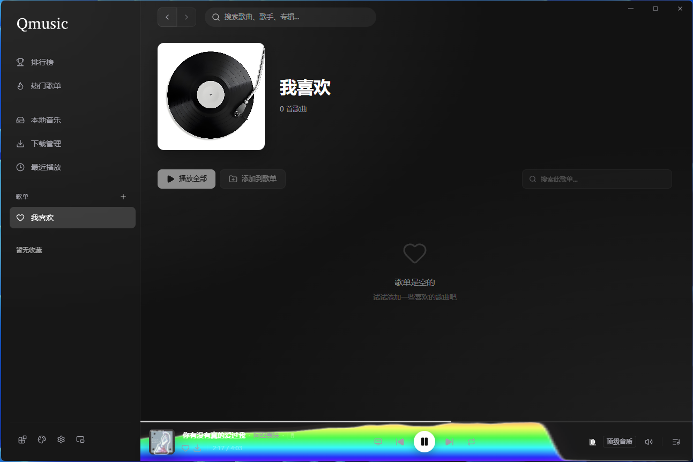
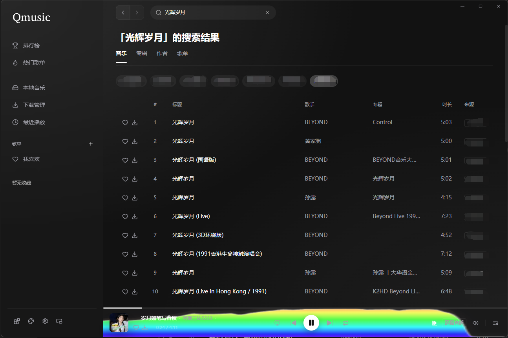
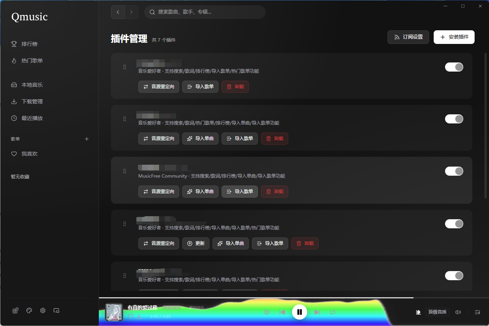
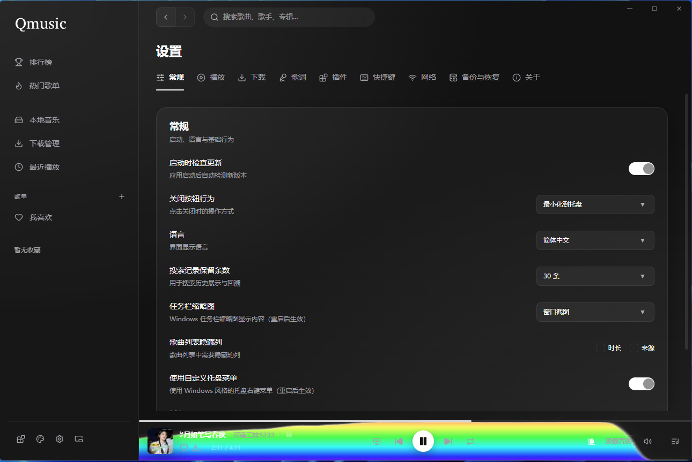
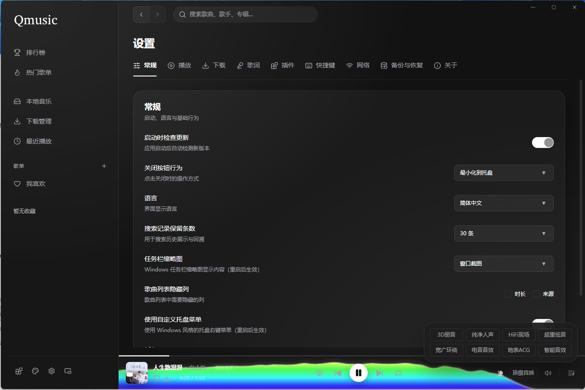
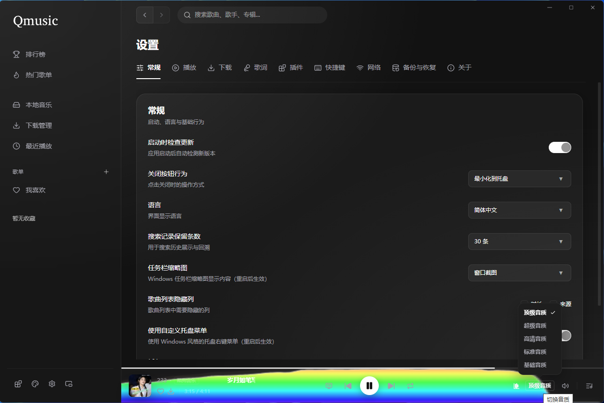
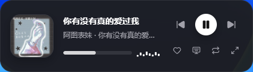

<div align="center">

# 🎵 QMusic

**音乐聚合播放器桌面端**

[](https://github.com/cnqvnet/Qmusic/stargazers)
[](https://github.com/cnqvnet/Qmusic/network/members)
[](https://gitcode.com/maotoumao/MusicFreeDesktop)
[](./LICENSE)
[](https://github.com/cnqvnet/Qmusic/releases)
[](https://github.com/cnqvnet/Qmusic/issues)
[](./package.json)

<a href="https://trendshift.io/repositories/3961" target="_blank"></a>

</div>

---

> [!IMPORTANT]
> **项目使用约定**
>
> 本项目基于 [AGPL 3.0](./LICENSE) 协议开源，使用此项目时请遵守开源协议。此外，希望你在使用代码时已了解以下额外说明：
>
> 1. 请不要用于商业用途，合法合规使用代码
> 2. 如果开源协议变更，将在此 GitHub 仓库更新，不另行通知

---

## ✨ 简介

音乐聚合播放器桌面端，支持 **Windows**、**macOS** 和 **Linux**。


### 📥 下载

👉 [全球Github](https://www.github.com/cnqvnet/Qmusic/releases)
👉 [国内Gitee](https://gitee.com/cnqvnet/Qmusic/releases)

---

## 🚀 特性

- 🔌 插件化：本软件仅仅是一个播放器，本身**不集成**任何平台的任何音源。所有搜索、播放、歌单导入等功能全部基于**插件**——只要互联网上有对应音源的插件，你都可以用本软件进行搜索和播放。
-  🚫 无广告：基于 AGPL 3.0 协议开源，将会保持免费。 
-  🔒 隐私：所有数据存储在本地，不会上传你的个人信息。 

**插件支持的功能**：搜索（音乐、专辑、作者、歌单）、播放、查看专辑、查看作者详情、导入单曲、导入歌单、获取歌词、排行榜、推荐歌单、歌曲评论、多音质切换（标准 / 高品 / 超品 / 无损）。

---

## 🔌 插件

 程序的核心能力由插件驱动。

- **开发文档**：[插件开发指南](https://musicfree.catcat.work/plugin/introduction.html)

### 插件能力一览

```
搜索 ─── 音乐 / 专辑 / 作者 / 歌单
播放 ─── 多音质切换 · 音源重定向
内容 ─── 专辑详情 · 作者作品 · 歌词 · 歌曲评论
发现 ─── 排行榜 · 推荐歌单 · 歌单分类
导入 ─── 单曲导入 · 歌单导入
```

### 插件沙箱

插件运行在安全沙箱中，可使用以下内置模块：

`axios` · `cheerio` · `dayjs` · `big-integer` · `qs` · `he` · `crypto-js` · `webdav`

---


## 更新


[详细更新日志](./CHANGELOG.md)

---

## 🛠️ 启动项目

### 环境要求

|  依赖   |  版本  |
| :-----: | :----: |
| Node.js | >= 24  |
|  pnpm   | latest |

### 快速开始

```bash
# 克隆仓库
git clone https://github.com/cnqvnet/Qmusic.git
cd Qmusic

# 安装依赖
pnpm install

# 启动应用
pnpm start

```
### 常用命令

|       命令        | 说明       |
| :---------------: | ---------- |
| `pnpm install` | 安装依赖 |
| `pnpm run format` | 代码格式化 |
|  `pnpm run lint`  | 代码检查   |
|  `pnpm run dev`   | 开发模式   |
|   `pnpm start`    | 启动应用   |
|  `pnpm run package` | 打包应用 |
|  `pnpm run make`  | 构建安装包 |
|  `pnpm run build` | 构建应用 |
---

```bash
# 查看所有依赖
pnpm list --depth=0

# 查看当前依赖（开发环境）
pnpm list --dev --depth=0

# 查看当前依赖（生产环境）
pnpm list --prod --depth=0

# 查看指定依赖
pnpm list <package-name>

# 检查过期依赖，是否需要更新
pnpm outdated

# 更新所有依赖
pnpm update

# 更新指定依赖
pnpm update <package-name>

```

## 当前依赖版本

```bash

Qmusic@2.0.0 D:\MusicFreeDesktop (PRIVATE)
│
│   dependencies:
├── @dnd-kit/core@6.3.1
├── @dnd-kit/modifiers@9.0.0
├── @dnd-kit/sortable@10.0.0
├── @dnd-kit/utilities@3.2.2
├── @emotion/is-prop-valid@1.4.0
├── axios@1.18.1
├── better-sqlite3@12.11.1
├── big-integer@1.6.52
├── blurhash@2.0.5
├── cheerio@1.2.0
├── compare-versions@6.1.1
├── crypto-js@4.2.0
├── dayjs@1.11.21
├── dompurify@3.4.12
├── esbuild@0.28.1
├── eventemitter3@5.0.4
├── framer-motion@12.42.2
├── he@1.2.0
├── hls.js@1.6.16
├── http-proxy-agent@9.1.0
├── https-proxy-agent@9.1.0
├── i18next@26.3.6
├── iconv-lite@0.7.3
├── jotai@2.20.1
├── jschardet@3.1.4
├── lucide-react@1.24.0
├── marked@18.0.6
├── music-metadata@11.13.0
├── nanoid@6.0.0
├── node-id3@0.2.9
├── p-queue@9.3.1
├── qs@6.15.3
├── react@19.2.7
├── react-dom@19.2.7
├── react-i18next@17.0.9
├── react-router@8.2.0
├── react-virtuoso@4.18.10
├── sharp@0.35.3
├── tinykeys@4.0.0
├── webdav@5.10.0
├── yauzl@3.4.0
│
│   devDependencies:
├── @electron-forge/cli@7.11.2
├── @electron-forge/maker-deb@7.11.2
├── @electron-forge/maker-dmg@7.11.2
├── @electron-forge/maker-flatpak@7.11.2
├── @electron-forge/maker-pkg@7.11.2
├── @electron-forge/maker-rpm@7.11.2
├── @electron-forge/maker-snap@7.11.2
├── @electron-forge/maker-squirrel@7.11.2
├── @electron-forge/maker-zip@7.11.2
├── @electron-forge/plugin-auto-unpack-natives@7.11.2
├── @electron-forge/plugin-fuses@7.11.2
├── @electron-forge/plugin-webpack@7.11.2
├── @electron/fuses@2.1.3
├── @eslint/js@10.0.1
├── @svgr/webpack@8.1.0
├── @timfish/forge-externals-plugin@0.2.2
├── @types/better-sqlite3@7.6.13
├── @types/he@1.2.3
├── @types/qs@6.15.1
├── @types/react@19.2.17
├── @types/react-dom@19.2.3
├── @types/yauzl@3.4.0
├── @vercel/webpack-asset-relocator-loader@1.10.0
├── cross-env@10.1.0
├── css-loader@7.1.4
├── electron@43.1.0
├── esbuild-loader@4.5.0
├── eslint@10.7.0
├── eslint-import-resolver-typescript@4.4.5
├── eslint-plugin-import@2.32.0
├── fork-ts-checker-webpack-plugin@9.1.0
├── globals@17.7.0
├── husky@9.1.7
├── lint-staged@17.0.8
├── node-loader@2.1.0
├── prettier@3.9.5
├── sass@1.101.0
├── sass-loader@17.0.0
├── style-loader@4.0.0
├── ts-loader@9.6.2
├── typescript@7.0.2
└── typescript-eslint@8.63.0

83 packages

```


## 🤝 参与贡献

欢迎参与贡献！请阅读 [贡献指南](./CONTRIBUTING.md) 了解开发规范与提交流程。

---

## � 支持这个项目

如果你喜欢这个项目，或者希望我可以持续维护下去，你可以通过以下方式支持：

1. ⭐ Star 这个项目，分享给你身边的人
2. 贡献代码，帮助改进项目

---

### 代码贡献

感谢[猫头猫](https://github.com/maotoumao) 提提供源代码。**代码出处**：[MusicFreeDesktop](https://github.com/maotoumao/MusicFreeDesktop)

---

## 📸 截图

#### 主页



#### 搜索



#### 插件管理



#### 设置



#### 均衡器



#### 音质选择



#### 迷你模式


